# 🦫 Beaver IM - 海狸即时通讯桌面端

> 🚀 **现代化桌面即时通讯应用** - 基于 Electron + Vue3 + TypeScript 构建，支持 Windows/macOS/Linux，提供完整的社交聊天体验

**当前版本：[2.0.0](VERSION)**（以仓库根目录 [`VERSION`](VERSION) 文件为准，与 `package.json` 同步）

[English](README_EN.md) | [中文](README.md)

---

## ✨ 核心特性

- 🔐 **账号登录** - 密码登录、扫码登录
- 💬 **即时通讯** - 私聊/群聊，支持文本、语音、Markdown、图片、视频、表情及转发回复
- 👥 **群组能力** - 创建群聊、群助手（Webhook 机器人）
- 🤝 **好友社交** - 好友申请与资料管理、朋友圈发布与互动
- 📞 **音视频通话** - 私聊/群聊语音视频通话
- 🖥️ **桌面体验** - 系统托盘、快捷键、区域截图、账号与存储设置
- 🔄 **实时同步** - WebSocket 长连接，与移动端消息数据保持一致

## 🛠️ 技术栈

- **Electron** 31 - 跨平台桌面应用
- **Vue 3** + **Vite** + **TypeScript** - 前端渲染与工程化
- **Pinia** + **Vue Router** - 状态管理与路由
- **SQLite** + **Drizzle ORM** - 本地消息与会话存储
- **WebSocket** - 实时消息推送
- **LiveKit** - 音视频通话

## 📱 功能展示

### 🔐 用户认证

  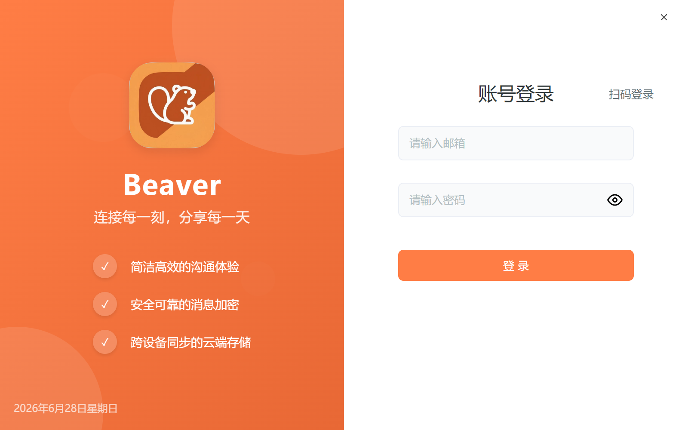
  

### 💬 聊天功能

  
  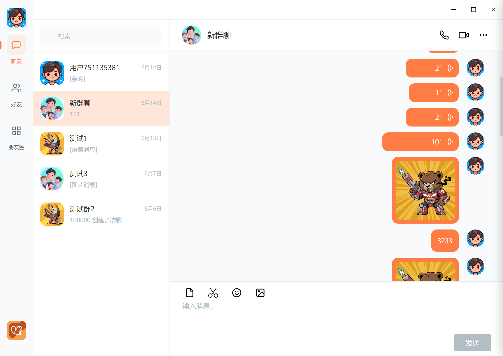
  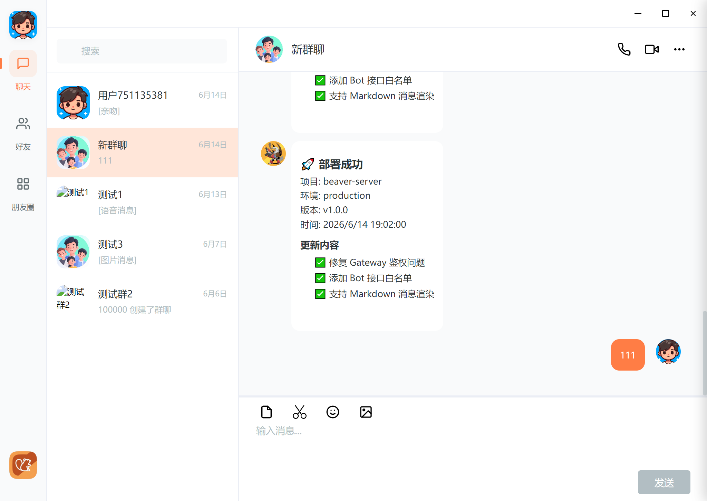
  
  
  
  
  
  
  
  
  
  

### 👥 群聊功能

  
  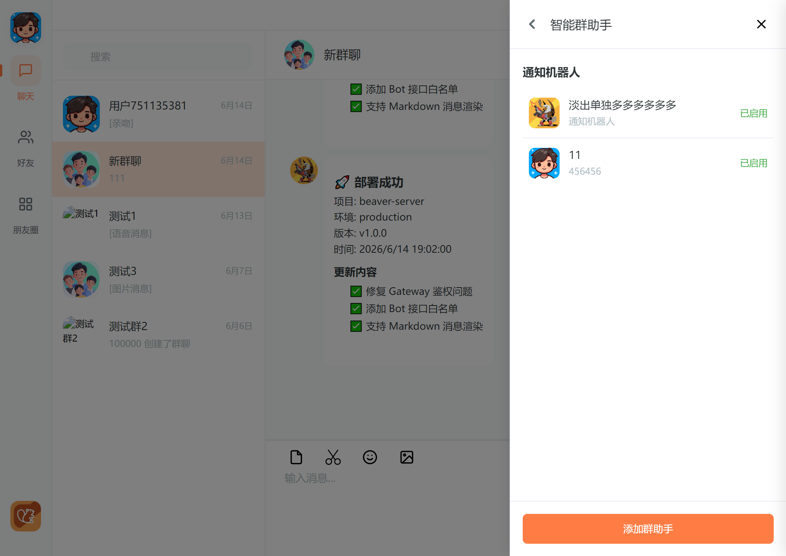
  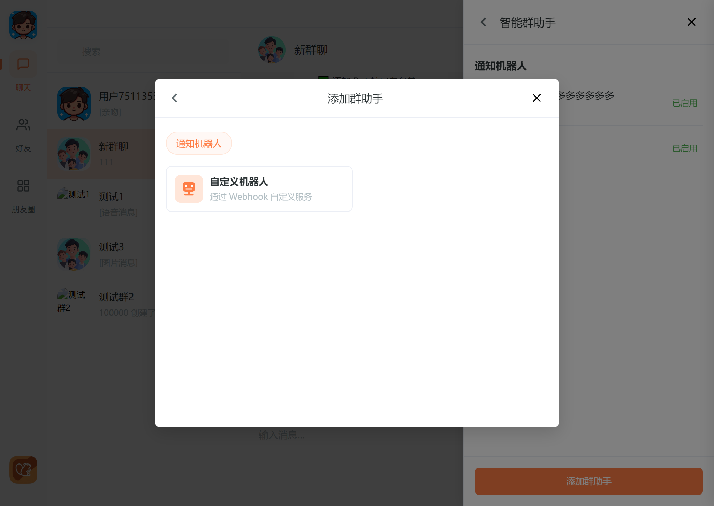

### 👥 好友管理

  
  
  

### 📸 朋友圈

  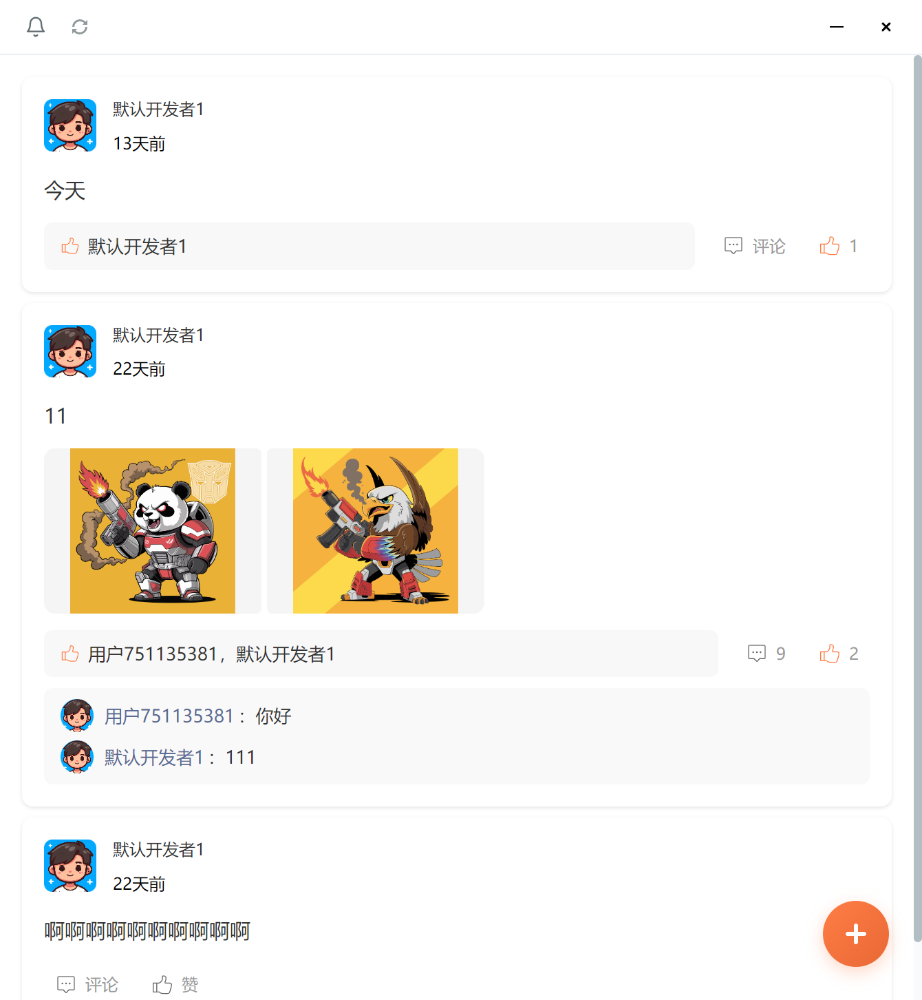
  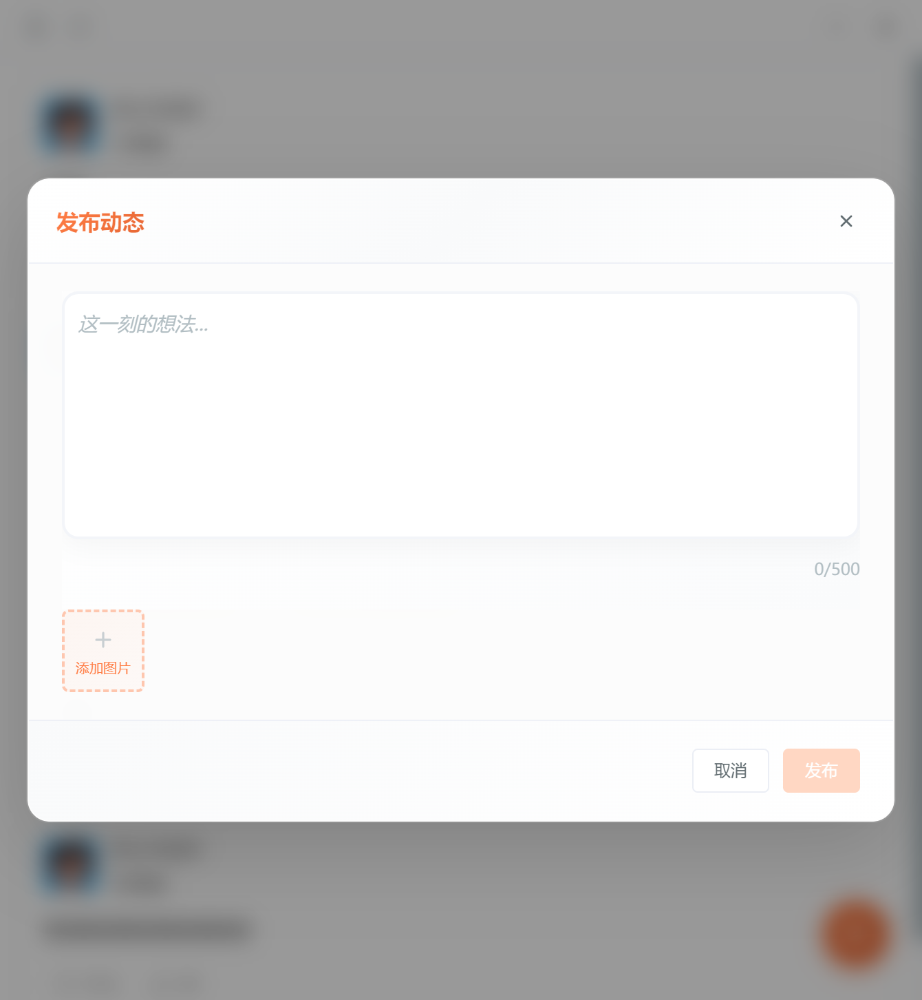
  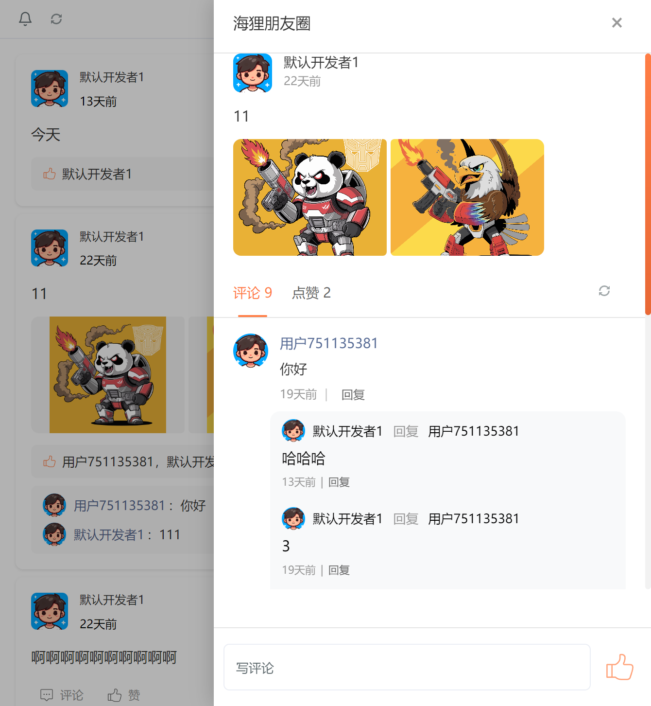
  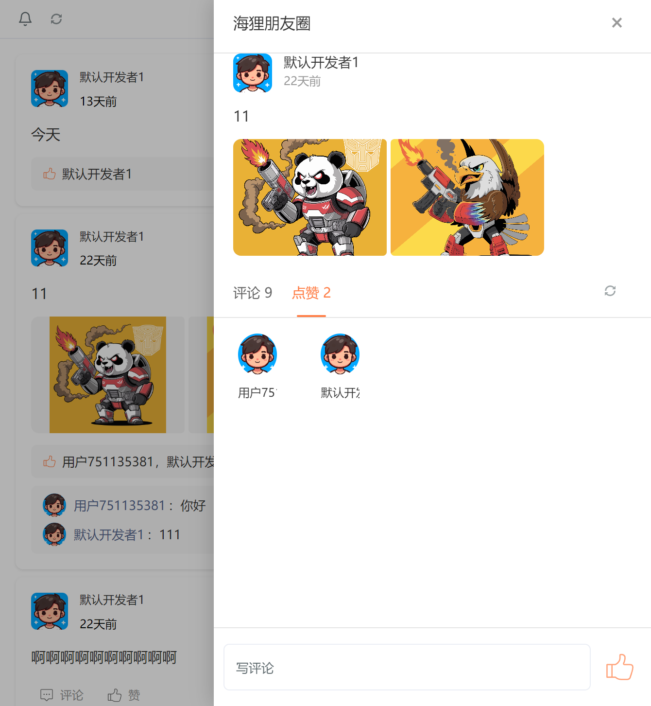
  

### 👤 个人中心

  

### ⚙️ 系统功能

  
  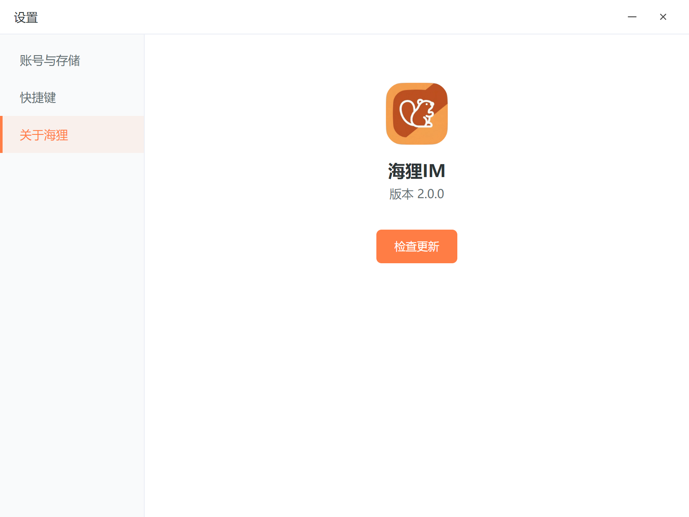
  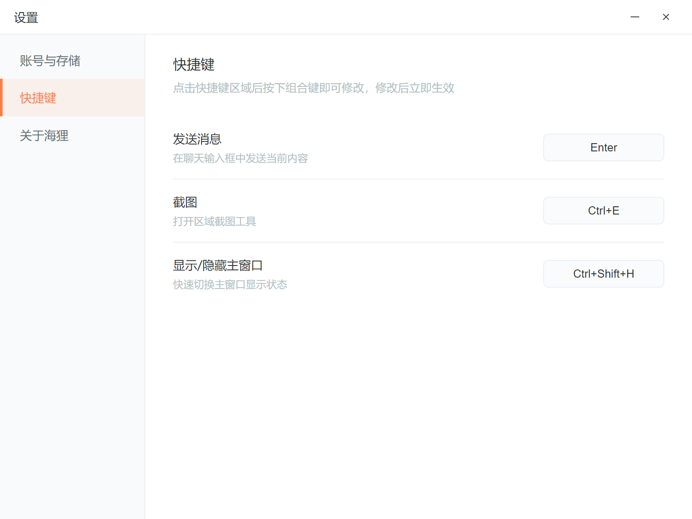
  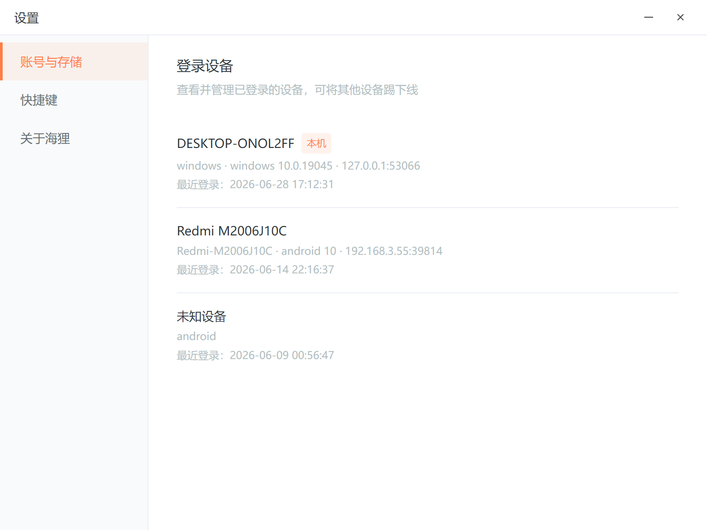

## 🔗 相关项目

| 项目 | 仓库地址 | 说明 |
|------|----------|------|
| **beaver-server** | [GitHub](https://github.com/wsrh8888/beaver-server) \| [Gitee](https://gitee.com/dawwdadfrf/beaver-server) | 后端微服务 |
| **beaver-flutter** | [GitHub](https://github.com/wsrh8888/beaver-flutter) \| [Gitee](https://gitee.com/dawwdadfrf/beaver-flutter) | 移动端（Flutter，推荐） |
| **beaver-desktop** | [GitHub](https://github.com/wsrh8888/beaver-desktop) \| [Gitee](https://gitee.com/dawwdadfrf/beaver-desktop) | 桌面端（Electron）（本仓库） |
| **beaver-manager** | [GitHub](https://github.com/wsrh8888/beaver-manager) \| [Gitee](https://gitee.com/dawwdadfrf/beaver-manager) | 后台管理系统 |
| **beaver-docs** | [GitHub](https://github.com/wsrh8888/beaver-docs) | 项目文档站 |
| **beaver-open** | [GitHub](https://github.com/wsrh8888/beaver-open) \| [Gitee](https://gitee.com/dawwdadfrf/beaver-open) | 开放平台 |
| **beaver-oauth** | [GitHub](https://github.com/wsrh8888/beaver-oauth) \| [Gitee](https://gitee.com/dawwdadfrf/beaver-oauth) | OAuth 授权登录 |
| **beaver-uniapp** | [GitHub](https://github.com/wsrh8888/beaver-uniapp) | 移动端（UniApp，已废弃） |

## 📚 文档与帮助

- 📖 **详细文档**: [Beaver IM 文档](https://wsrh8888.github.io/beaver-docs/)
- 📝 **更新记录**: [CHANGELOG.md](CHANGELOG.md)
- 🎥 **视频教程**: [B站教程](https://www.bilibili.com/video/BV1HrrKYeEB4/)
- 💬 **QQ群**:
  - [1013328597](https://qm.qq.com/q/82rbf7QBzO) - 群一
  - [1044762885](https://qm.qq.com/q/82rbf7QBzO) - 群二
  - [1003121259](https://qm.qq.com/q/82rbf7QBzO) - 群三

## ⭐ 支持项目

如果这个项目对你有帮助，请给我们一个 ⭐ Star！

## ☕ 请作者喝杯茶

如果这个项目对你有帮助，欢迎请作者喝杯茶 ☕

  
  

## 📄 开源协议与免责声明

本项目基于 [MIT](LICENSE) 协议开源 - 详情请参阅 [LICENSE](LICENSE) 文件。

### ⚖️ 使用说明

**项目定位**：本项目主要用于**技术学习和交流**，希望为开发者提供一个学习和研究的平台。

**使用建议**：
- 📚 **学习交流** - 欢迎用于个人学习、技术研究、学术交流
- 🤝 **开源贡献** - 欢迎提交代码改进、Bug修复、功能建议
- 🔒 **合规使用** - 请确保使用方式符合当地法律法规
- 💡 **创新应用** - 鼓励基于本项目进行创新性应用开发

**温馨提示**：
- 本项目采用 MIT 开源协议，您可以自由使用、修改和分发
- 建议在使用前仔细阅读相关法律法规，确保合规使用
- 如有疑问或需要帮助，欢迎通过 QQ 群或 GitHub Issues 交流

### 📋 项目来源标注要求

**重要**：如果您基于本项目进行二次开发或发布，**必须**在项目中保留以下信息：

#### 🖥️ **前端项目（移动端/桌面端/Web应用）**
- **关于页面**：必须在"关于我们"、"关于应用"或类似页面中包含项目来源标注
- **必需文本**："基于 [Beaver IM](https://github.com/wsrh8888/beaver-server) 开源IM项目开发"
- **链接**：必须提供可点击的原始项目链接

#### 🔧 **后端项目（服务器/API服务）**
- **README.md**：必须在项目介绍或描述中包含来源标注
- **必需文本**："基于 [Beaver IM](https://github.com/wsrh8888/beaver-server) 开源IM项目开发"
- **链接**：必须提供可点击的原始项目链接

#### 📄 **通用要求**
- **LICENSE 文件**：保留原项目 MIT 协议信息

> 💡 **友好提醒**：本项目允许个人及商业使用；基于本项目二次开发或发布时，**必须保留项目来源标注**，详见上方要求。

> 📖 **详细法律条款**：请参阅 [LEGAL.md](LEGAL.md) 文件了解完整的法律免责声明和使用要求。

## ⭐ Star历史

