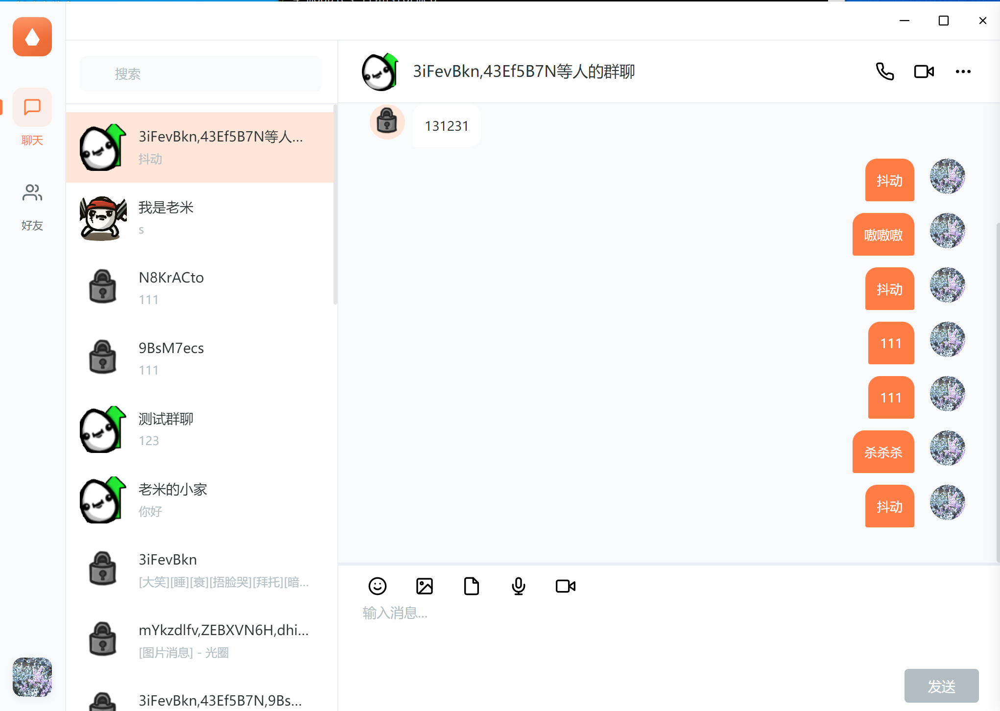

# 海狸IM

### 更新日期
2025-06-03

### 文档地址
https://wsrh8888.github.io/beaver-docs/

### 项目介绍
+ 前端使用uniapp， 后端使用go-zero， 桌面端使用electron
+ 如果喜欢可以点一个star
+ 加入QQ群：（1013328597）

### 启动命令教程：

npm install

npm run dev

### 项目列表
| [GitHub仓库]    |   [Gitee仓库]    |说明                                                                                      
| ------------------------------------------------------------ | --------------------------------------------------------------------------|--------------------------------------------------------------------------|
| [beaver-server](https://github.com/wsrh8888/beaver-server)               |[beaver-server](https://gitee.com/dawwdadfrf/beaver-server)               | 后端服务  |
| [beaver-mobile](https://github.com/wsrh8888/beaver-mobile)        | [beaver-mobile](https://gitee.com/dawwdadfrf/beaver-mobile)               |手机端 |
| [beaver-desktop](https://github.com/wsrh8888/beaver-desktop)        | [beaver-desktop](https://gitee.com/dawwdadfrf/beaver-desktop)               |桌面端 |

### 更新记录
20250604
- 1、注册登录界面完成
- 2、最近消息列表完成
- 3、好友聊天和消息同步完成
- 4、好友列表和群聊列表完成

### 应用截图

登录界面

注册界面界面

好友界面

群组界面

聊天界面

表情包界面

